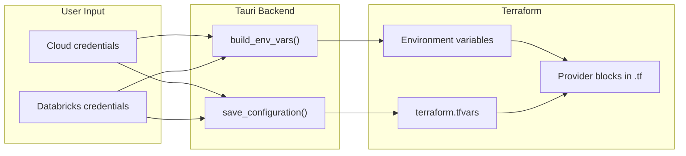

# Authentication Paths

This document explains how the Databricks Deployer app authenticates with cloud providers and Databricks APIs. It covers what users choose in the UI, how those choices translate to Terraform configuration, and how credentials are validated before deployment.

## Three Independent Auth Dimensions

Every deployment involves three separate authentication concerns:

1. **Cloud provider** — AWS, Azure, or GCP resources (VPCs, storage, networking)
2. **Databricks account** — account-level API for creating workspaces and metastores
3. **Databricks workspace** — workspace-level API for configuring users, catalogs, etc.

Cloud auth and Databricks auth are **independent choices**. For example, you can authenticate to AWS with a CLI profile while using a Databricks service principal — these don't need to match.

The exception is **GCP**, where the GCP service account is reused for Databricks authentication (there is no separate profile/SP choice).

## How Credentials Reach Terraform

The app delivers credentials to Terraform through two mechanisms:

- **Environment variables** `[env]` — set by `build_env_vars()` before launching the Terraform process
- **Terraform variables** `[tfvar]` — written to `terraform.tfvars` by `save_configuration()`

This distinction matters because different clouds use different delivery mechanisms. The tables below annotate each credential with `[env]` or `[tfvar]` so you can tell at a glance.



---

## AWS

### User choices

| Step | Options |
|------|---------|
| Cloud auth | **CLI profile** (recommended) or **access keys** |
| Databricks auth | **CLI profile** or **service principal** (client ID + secret) |

### Authentication matrix

| Cloud Auth | DB Auth | Cloud TF Provider | DB Account TF Provider | DB Workspace TF Provider | Metastore Check |
|-----------|---------|-------------------|----------------------|------------------------|----------------|
| CLI profile | Profile | `AWS_PROFILE` `[env]` | `auth_type = "databricks-cli"` `[tfvar]` + `DATABRICKS_CONFIG_PROFILE` `[env]` | Inherits from env — no explicit HCL attributes | Databricks CLI: `account metastores list` |
| CLI profile | Service principal | `AWS_PROFILE` `[env]` | `auth_type = "oauth-m2m"` `[tfvar]` + `DATABRICKS_CLIENT_ID`, `DATABRICKS_CLIENT_SECRET` `[env]` | Inherits from env — no explicit HCL attributes | OAuth2 token exchange, then accounts API |
| Access keys | Profile | `AWS_ACCESS_KEY_ID`, `AWS_SECRET_ACCESS_KEY`, `AWS_SESSION_TOKEN` `[env]` | `auth_type = "databricks-cli"` `[tfvar]` + `DATABRICKS_CONFIG_PROFILE` `[env]` | Inherits from env — no explicit HCL attributes | Databricks CLI: `account metastores list` |
| Access keys | Service principal | `AWS_ACCESS_KEY_ID`, `AWS_SECRET_ACCESS_KEY`, `AWS_SESSION_TOKEN` `[env]` | `auth_type = "oauth-m2m"` `[tfvar]` + `DATABRICKS_CLIENT_ID`, `DATABRICKS_CLIENT_SECRET` `[env]` | Inherits from env — no explicit HCL attributes | OAuth2 token exchange, then accounts API |

### Why it works this way

The AWS Terraform templates declare minimal `provider "databricks"` blocks — they set `auth_type` from a tfvar but rely on the Databricks SDK's environment variable resolution for actual credentials (`DATABRICKS_CONFIG_PROFILE` or `DATABRICKS_CLIENT_ID`/`SECRET`). The `aws` provider reads credentials entirely from environment variables with no HCL attributes for auth.

### Notes

1. When using a **CLI profile**, the app clears `AWS_ACCESS_KEY_ID`, `AWS_SECRET_ACCESS_KEY`, and `AWS_SESSION_TOKEN` to prevent conflicts with any values inherited from the shell.
2. When using **access keys**, the app clears `AWS_PROFILE` for the same reason.
3. The same clearing logic applies to Databricks: profile mode clears `DATABRICKS_CLIENT_ID`/`SECRET`, and SP mode clears `DATABRICKS_CONFIG_PROFILE`.

---

## Azure

### User choices

| Step | Options |
|------|---------|
| Cloud auth | **Azure CLI** (recommended) or **service principal** |
| Databricks auth | **Azure Identity** (uses your Azure CLI session — account ID only), **CLI profile**, or **service principal** |

Azure Identity is only available when cloud auth is Azure CLI with admin privileges. It reuses your Azure AD session for Databricks, so no separate Databricks credentials are needed.

### Authentication matrix

> Cloud auth and Databricks auth are **independent dimensions** — changing one doesn't affect the other. The Databricks columns below are identical whether cloud auth is CLI or SP.

| Cloud Auth | DB Auth | Cloud TF Provider | DB Account TF Provider | DB Workspace TF Provider | Metastore Check |
|-----------|---------|-------------------|----------------------|------------------------|----------------|
| CLI | Azure Identity | `ARM_TENANT_ID`, `ARM_SUBSCRIPTION_ID` `[env]` | `auth_type = "azure-cli"` `[tfvar]` | `auth_type = "azure-cli"` `[tfvar]` | Azure AD token, then accounts API |
| CLI or SP | Profile | `ARM_TENANT_ID`, `ARM_SUBSCRIPTION_ID` `[env]` (+ `ARM_CLIENT_ID`, `ARM_CLIENT_SECRET` if SP) | `auth_type = "databricks-cli"`, `profile` `[tfvar]` | `auth_type = "databricks-cli"` `[tfvar]` | Databricks CLI: `account metastores list` |
| CLI or SP | Service principal | `ARM_TENANT_ID`, `ARM_SUBSCRIPTION_ID` `[env]` (+ `ARM_CLIENT_ID`, `ARM_CLIENT_SECRET` if SP) | `auth_type = "oauth-m2m"`, `client_id`, `client_secret` `[tfvar]` | `auth_type = "oauth-m2m"`, `client_id`, `client_secret` `[tfvar]` | OAuth2 token exchange, then accounts API |

### Why it works this way

Unlike AWS, the Azure Terraform templates pass Databricks credentials **explicitly in HCL** using conditional expressions:

```hcl
provider "databricks" {
  auth_type     = var.databricks_auth_type
  client_id     = var.databricks_auth_type == "oauth-m2m" ? var.databricks_client_id : null
  client_secret = var.databricks_auth_type == "oauth-m2m" ? var.databricks_client_secret : null
  profile       = var.databricks_auth_type == "databricks-cli" ? var.databricks_profile : null
}
```

Because of this, the app writes all Databricks credentials as **tfvars** (not env vars). No `DATABRICKS_*` environment variables are set for Azure deployments.

The `azurerm` provider, on the other hand, reads auth from `ARM_*` environment variables, or falls back to Azure CLI when no `ARM_CLIENT_ID` is set.

### Notes

1. Azure Identity mode (`azure-cli`) obtains an Azure AD token for the Databricks resource ID (`2ff814a6-3304-4ab8-85cb-cd0e6f879c1d`) via `az account get-access-token`. This is the same token the Terraform `databricks` provider uses internally.
2. The workspace provider uses the same `auth_type` and credentials as the account provider, just pointed at the workspace URL instead of `accounts.azuredatabricks.net`.

---

## GCP

### User choices

| Step | Options |
|------|---------|
| Cloud auth | **Application Default Credentials / ADC** (recommended) or **service account JSON key** |
| Databricks auth | None — the GCP service account is reused for Databricks authentication |

GCP is structurally different from AWS and Azure. There is no separate Databricks profile or service principal choice. The same service account that authenticates with Google Cloud also authenticates with Databricks.

### Authentication matrix

| Cloud Auth | Cloud TF Provider | DB Account TF Provider | DB Workspace TF Provider | Metastore Check |
|-----------|-------------------|----------------------|------------------------|----------------|
| ADC (impersonation) | `GOOGLE_OAUTH_ACCESS_TOKEN`, `GOOGLE_APPLICATION_CREDENTIALS` `[env]`; `credentials = null` in HCL; `project` `[tfvar]` | `google_service_account` `[tfvar]` | `google_service_account` `[tfvar]` | ID token via IAM `generateIdToken` API |
| SA JSON key | `GOOGLE_CREDENTIALS` `[env]`; `credentials` `[tfvar]` in HCL; `project` `[tfvar]` | `google_credentials` `[tfvar]` | `google_credentials` `[tfvar]` | ID token via JWT signing with SA private key |

### Why it works this way

The GCP Terraform templates select between two patterns based on a `gcp_auth_method` tfvar:

```hcl
provider "databricks" {
  google_service_account = var.gcp_auth_method == "impersonation" ? var.google_service_account_email : null
  google_credentials     = var.gcp_auth_method == "credentials"   ? var.google_credentials_json : null
}
```

- **Impersonation** (ADC): The user's gcloud OAuth token is passed as `GOOGLE_OAUTH_ACCESS_TOKEN` and the ADC file path as `GOOGLE_APPLICATION_CREDENTIALS`. Terraform uses these to impersonate the service account.
- **Credentials** (SA key): The JSON key content is passed both as `GOOGLE_CREDENTIALS` env var (for the `google` provider) and as `google_credentials_json` tfvar (for the `databricks` provider).

There is no `auth_type` attribute — the Databricks GCP provider infers the auth method from which attribute (`google_service_account` vs `google_credentials`) is non-null.

### Notes

1. `DATABRICKS_CONFIG_FILE=/dev/null` is set for all GCP deployments to prevent the Databricks SDK from reading `~/.databrickscfg`, which could conflict with the GCP auth flow.
2. For ADC, the app resolves the credentials file path by checking `~/.config/gcloud/application_default_credentials.json` first, then legacy paths.
3. `GOOGLE_OAUTH_ACCESS_TOKEN` is refreshed via `gcloud auth print-access-token` at deploy time (with impersonation disabled to get the user's own token).

---

## Pre-deploy Credential Validation

Before Terraform runs, the app validates that the provided credentials actually work. This is a separate step from Terraform provider configuration — it uses direct API calls or CLI commands to verify access.

| Auth Method | What the app does | Backend function |
|------------|-------------------|-----------------|
| Azure Identity | Runs `az account get-access-token --resource 2ff814a6-...`, then calls the Databricks SCIM Users API with the token | `validate_azure_databricks_identity` |
| Databricks CLI profile | Runs `databricks account users list --profile {name}` | `validate_databricks_profile` |
| Service principal (AWS/Azure) | Exchanges client ID + secret for an OAuth token at `{host}/oidc/accounts/{id}/v1/token`, then calls the SCIM Users API | `validate_databricks_credentials` |
| GCP with ADC | Uses the user's OAuth token to call IAM `generateIdToken` for the service account, then calls Databricks accounts API | `validate_gcp_databricks_access` |
| GCP with SA key | Signs a JWT with the SA private key, exchanges it for a GCP ID token, then calls Databricks accounts API | `validate_gcp_databricks_access_with_key` |

### Metastore check

After validation, the app checks for existing Unity Catalog metastores in the target region. It uses the same credentials obtained during validation:

- **Profile auth**: `databricks account metastores list --profile {name}`
- **SP / Azure Identity / GCP**: Bearer token to `GET /api/2.0/accounts/{id}/metastores`

If the check fails (e.g., insufficient permissions), the app falls back gracefully with a message that metastore detection is unavailable and any existing metastore will be auto-detected during deployment.

---

## Source Code Reference

| Concept | File | Key function / section |
|---------|------|----------------------|
| Environment variable mapping | `src-tauri/src/commands/deployment.rs` | `build_env_vars()` |
| Terraform variable generation | `src-tauri/src/commands/deployment.rs` | `save_configuration()` |
| Credential validation + metastore checks | `src-tauri/src/commands/databricks.rs` | `validate_*` functions, `check_uc_permissions()` |
| AWS provider blocks | `src-tauri/templates/aws-simple/providers.tf` | |
| Azure provider blocks | `src-tauri/templates/azure-sra/providers.tf` | |
| GCP provider blocks | `src-tauri/templates/gcp-simple/providers.tf` | |
| User-facing credential UI | `src/components/screens/credentials/*.tsx` | |
| Credential state management | `src/context/WizardContext.tsx` | `credentials`, `setCredentials` |
